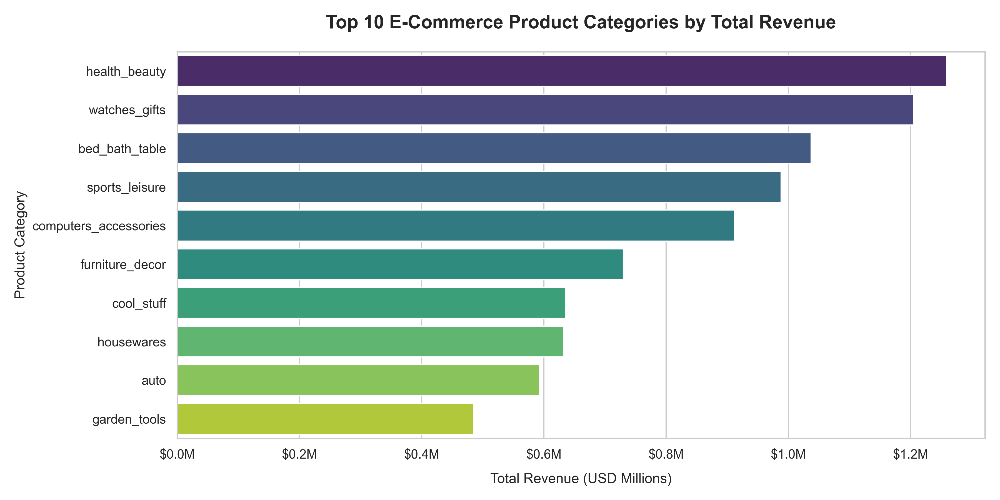

# Olist Brazilian E-Commerce Performance Analysis

## 🎯 Project Overview
This project provides an end-to-end data engineering and analytics solution for evaluating product category velocity within a large-scale Brazilian e-commerce dataset containing over **100k records**. 

The goal of this analysis is to transform raw operational data into strategic catalog optimization recommendations for executive stakeholders.

---

## 🛠️ Tech Stack Used

* **Database Management Engine:** SQLite
* **Pipeline Infrastructure:** Python (`sqlite3`, `pandas`)
* **Visualization Suite:** `matplotlib`, `seaborn`

---

## 🔑 Key Business Insights

1. **Volume vs. Value Disconnect:** While `bed_bath_table` represents the highest volume of unique stock keeping units (SKUs) in the entire marketplace, it drops to **3rd place** in actual value generation.
2. **High-Velocity Revenue Drivers:** The `health_beauty` and `watches_gifts` sectors are the primary revenue engines of the platform—each generating **over \$1.2M USD** in total transactional revenue despite carrying lower retail stock depth.
3. **Strategic Catalog Action:** The executive team should transition capital allocation away from aggressively sourcing low-margin bedding inventory and prioritize expanding premium watch and health/beauty vendor partnerships to optimize revenue-per-SKU ratios.

---

## 📊 Core Visualization
Below is the structured analysis layout showing the top 10 revenue-generating product classes across the entire marketplace platform:

---

## 🏗️ Project Architecture & Pipeline
How the project is structured linearly to ensure reproducibility:

1. **`import.py`:** Automatically parses, cleans, and converts 9 isolated relational CSV logs into structured SQL database tables (`olist_ecommerce.db`).
2. **`query.py`:** Executes advanced relational `JOIN` algorithms across product logs, sales ledger entries, and translation tables to perform clean currency aggregations.
3. **`chart.py`:** Extracts processed records into Pandas data frames to engineer and format high-definition diagnostic visualizations.
